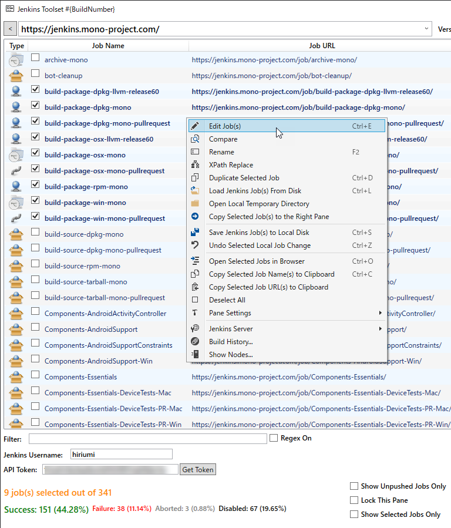

# Jenkins Toolset

## Summary
Jenkins Toolset allows you to manage Jenkins jobs on multiple instances of Jenkins master. 

## Architecture
Jenkins Toolset utilizes the RESTful API that Jenkins provides. In other words, the only communication that happens is HTTP(S) communication between Jenkins Toolset and Jenkins master.

## Jenkins jobs as XML files
If you hit an URL like https://yourserver/job/sample-job/config.xml, you will get XML configuration file that represents the job. Imagine a situation where you need to make the same change to 500 jobs. You are lucky if you manage your jobs with Job DSL but that is not the case at many software shops. Jenkins Toolset allows you to open config.xml locally in any text editor you like (who doesn\'t use <a href="https://notepad-plus-plus.org/">Notepad++</a>?), and push the changes back to your Jenkins master.